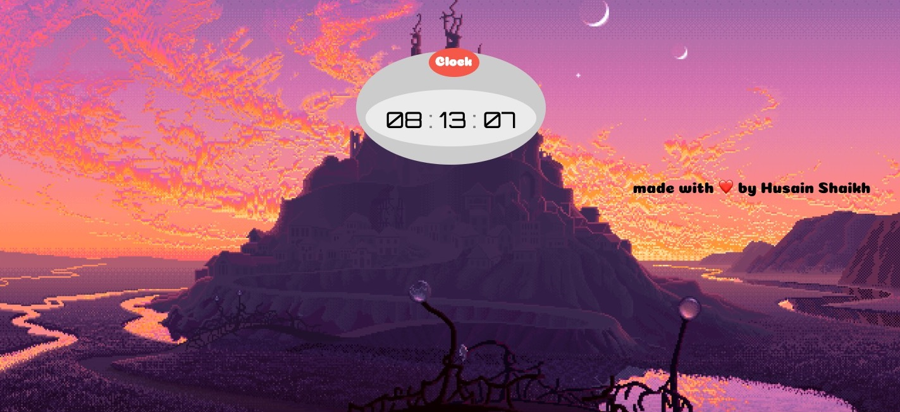

# Clock
Digital Clock using HTML, CSS, JS. Tutorial from [whatsdev](https://www.youtube.com/watch?v=DUEyiEnMVj4)

Mini Project on Web-Development using HTML, CSS and JavaScript.

The Clock shows current time in 12 hour format with refresh rate 1 second.

Added some animation to the clock using css.
